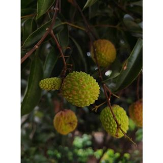
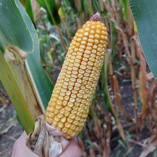
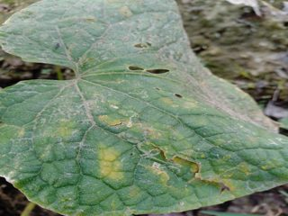
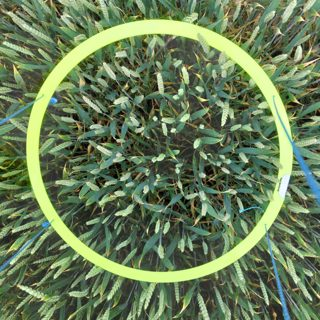
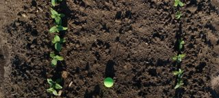
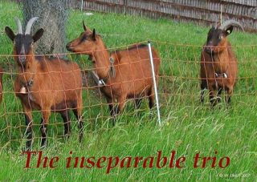
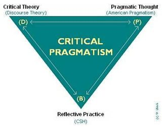
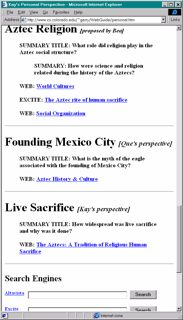
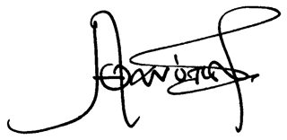

# Relevance policy

What counts as an image of interest for AGRIFM-G, and what does not. This document is the
specification that the hand labels, the filter thresholds and the model prompts all follow.
If a rule here is wrong, change it here first — not in the code.

*Version 1 — 2026-09-18. Changing a rule bumps the version and invalidates labels that
depended on it.*

## The question a labeller asks

> **Does this image show a plant, a crop, or agricultural activity as its actual subject?**

Subject, not context. A conference poster *about* wheat is not an image of wheat. A photograph
of a field *is*, even if a person or a tractor is in it.

## Keep

| class | what it means | example |
| --- | --- | --- |
| **organ** | a plant part as the subject: leaf, fruit, ear, grain, root, seed, flower, stem — in the field, in the hand, or on a neutral background |   |
| **symptom** | disease, pest damage, or abiotic stress on a plant, at any scale |  |
| **canopy / plot** | a crop stand seen from above or from the side: quadrats, plots, rows, trial layouts |   |
| **field scene** | agricultural land as the subject, including bare soil in an evidently cultivated field, pasture, orchards, greenhouses |  |
| **practice** | farming activity and the tools of it: sowing, grafting, pruning, irrigation, spraying, harvesting, machinery in use | — |
| **setup** | a phenotyping rig, sensor, drone, growth chamber or lab bench **with plants visible in it** | — |

## Which family each keep class serves

[The dataset goal](index.md) asks for three *complementary* families, not one big pile. Each
keep class is here because it serves one of them, and a labeller should record which:

| family | profile | keep classes that serve it | what "enough" looks like |
| --- | --- | --- | --- |
| **1 — pure phenotyping** | disparate, condensed, precise | organ, symptom, canopy / plot, setup | precise plant imagery: UAV, ground-based, greenhouse, controlled backgrounds; usable for counting, detection, segmentation |
| **2 — operational agriculture** | disparate, moderately condensed, diverse | field scene, practice, and the *setup* rigs themselves | farms, tools, machines, grafting, pruning, irrigation, harvest — the working context, not the measurement |
| **3 — niche** | disparate, sparsely condensed, moderately diverse | organ and canopy of **infrequent species, rare crops, or fine-grained taxa**; herbarium specimens | breadth of species and cultivars, not volume per species |

**Selection principle, inherited from the goal: prefer what fills a gap.** An image of a crop
already represented a thousand times is worth less than the first image of a rare one. Two
practical consequences for everything downstream:

- A labeller records the family alongside the keep, and records the **species or crop** when
  identifiable — that field is what later lets us measure coverage rather than count.
- The filter must not be tuned to maximise kept images. It is tuned to keep family 1 precise,
  family 2 diverse, and family 3 present at all — a filter that silently discards the rare and
  the visually unusual is failing even when its overall precision looks excellent.

Family 3 is the one a generic agricultural classifier will hurt most: an unusual species,
an unfamiliar organ or a herbarium sheet is exactly what a prompt set written around wheat,
maize and tomato will score low. Recall on family 3 is reported separately.

The first three classes serve phenotyping directly (family 1); *field scene*, *practice* and
*setup* serve the operational family (family 2); rarity, not appearance, is what puts an image
in family 3.

## Reject

| class | example |
| --- | --- |
| **chart / plot / diagram** — any rendered figure, including schematics and flow diagrams |  |
| **logo / branding / icon** |  |
| **screenshot / UI / page of text / table** |  |
| **signature, stamp, handwriting** |  |
| **portrait / person as subject** |  |
| **blank, near-blank, rule, separator, scan artefact** |  |
| **satellite and aerial remote sensing, maps** — explicitly excluded by the dataset goal, however agricultural the terrain | — |
| **anything else unrelated** — buildings, vehicles off-farm, animals outside an agricultural setting, stock photography | — |

## Borderline classes, decided

These are the cases where two labellers would otherwise disagree. Each ruling is a judgment
call, recorded so it is applied consistently and can be revisited as a unit.

| class | ruling | why |
| --- | --- | --- |
| **microscopy and histology** | **reject**, tagged `microscopy` | A different visual domain from ground-level photography; pretraining on it teaches textures the target task never sees. Tagged rather than discarded, so a later decision can recover them. |
| **herbarium and pressed specimens** | **keep** | Real plant organs, flat lighting, excellent species and morphology coverage — exactly the taxonomic diversity family 3 asks for. |
| **harvested produce** | **keep** if the produce is recognisably a plant organ (grain in a tray, fruit on a bench); **reject** once processed or plated (bread, cooked dishes, milled flour) | The line is whether phenotype is still visible. |
| **packaging, labels, product shots** | **reject** | Branding, not phenotype, even for agricultural products. |
| **soil close-ups** | **keep** only with plants or cultivation visible; **reject** for pure soil or substrate texture | Bare soil in a planted field is a field scene; a soil texture swatch is not. |
| **livestock** | **keep** when in an evidently agricultural setting (pasture, barn, paddock) | Family 2 covers farms and practices. Not phenotyping data, but operational agriculture. It is tagged `livestock` so it can be excluded from a plant-only mix. |
| **drawings and botanical illustrations of plants** | **reject** | Rendered, not photographed. Falls under diagrams. |

## Open rulings after the first labelling pass

The first 567 labelled images raised five classes this policy did not anticipate. They are
recorded as `borderline` in the label set and listed in [the labelled set](labelling.md);
until they are ruled on, the labels that depend on them are provisional: **silviculture**,
**fungi**, **wild (uncultivated) vegetation**, **people-in-a-field**, and **woody biomass**.

## Precedence

When rules collide, apply in this order:

1. **Rendered beats depicted.** A chart of yield is a chart, not a crop.
2. **Satellite beats agricultural.** An aerial field is still remote sensing, still rejected.
3. **Subject beats setting.** A person in a field, framed as a portrait, is a portrait.
4. **When still genuinely undecidable, label `borderline`** with a note rather than guessing.
   A class that collects more than ~5 % of labels gets its own ruling in the table above.

## Labels this produces

`keep` / `reject` / `borderline`, plus one class tag from the tables above, plus the **family**
(1, 2 or 3) for a keep, plus **species or crop** when identifiable, plus optional free-text for
anything the policy failed to anticipate. This is the schema the labelling issue implements.

## What the current sample looks like

Applying this policy by eye to the 43 images extracted in the committed build:
**one** is a keep (goats on pasture — a *field scene*), and it survives only because livestock
was ruled in. The other 42 are logos, signatures, screenshots, portraits, diagrams and blank
strips.

That is the number every later stage has to be read against: the base rate of interesting
images in unfiltered FinePDF is on the order of **2 %**, and the sample is too small to
pin down further. Two consequences:

- **Precision claims are cheap, recall claims are not.** A filter that rejects everything is
  98 % accurate. Any reported figure must be precision *and* recall against the labelled set.
- **Labelling 300 images from this distribution yields perhaps 5–10 positives**, which is not
  enough to measure recall. The labelling pass must therefore over-sample candidates — for
  example by drawing from documents that the text gate scores highly — and record that the
  sampling was stratified, so the base rate is not read off the labelled set.
